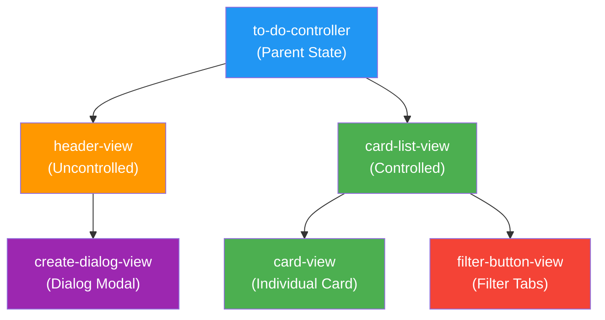

<p align="center">
  <h1 align="center">material_ui_todo_app</h1>
  <p align="center">
    A to-do list application built with React and Material-UI — featuring card views, filtering, sorting, and a clean component-based architecture.
  </p>
</p>

<p align="center">
  <a href="https://github.com/girijashankarj/material_ui_todo_app"></a>
  
  
  
  
</p>

---

## Table of Contents

- [Overview](#overview)
- [Features](#features)
- [Tech Stack](#tech-stack)
- [Quick Start](#quick-start)
- [Component Architecture](#component-architecture)
- [Project Structure](#project-structure)
- [Scripts Reference](#scripts-reference)
- [Contributing](#contributing)
- [License](#license)

---

## Overview

**material_ui_todo_app** is a React to-do application that demonstrates component hierarchy, state management, and Material-UI integration. Users can create tasks with deadlines, sort by date, filter by completion status, and toggle tasks — all rendered in a clean card-based layout.

---

## Features

- **Create to-do items** — with deadline and creation date
- **Card view display** — Material-UI cards for each task
- **Sort** — by deadline or creation date
- **Filter** — by completion status (tabs)
- **Toggle complete/incomplete** — mark tasks as done
- **Create dialog** — Material-UI modal for new tasks
- **Responsive** — Material-UI grid layout

---

## Tech Stack

|                  | Details                              |
| ---------------- | ------------------------------------ |
| **Framework**    | React 16.12                          |
| **Build Tool**   | Create React App                     |
| **UI Library**   | Material-UI v4.8                     |
| **Utilities**    | Lodash 4.17, UUID v3                 |
| **Testing**      | Jest + React Testing Library         |

---

## Quick Start

```bash
git clone https://github.com/girijashankarj/material_ui_todo_app.git
cd material_ui_todo_app
npm install
npm start
```

Open [http://localhost:3000](http://localhost:3000) in your browser.

---

## Component Architecture



| Component            | Role                                        |
| -------------------- | ------------------------------------------- |
| `to-do-controller`   | Parent — holds state, passes props down     |
| `header-view`        | Uncontrolled — manages its own dialog state |
| `create-dialog-view` | Create dialog modal for new tasks           |
| `card-list-view`     | Controlled — receives and displays tasks    |
| `card-view`          | Individual task card with toggle            |
| `filter-button-view` | Filter tabs for completion status           |

---

## Project Structure

```
material_ui_todo_app/
├── public/
│   ├── index.html              # HTML template
│   ├── favicon.ico
│   ├── manifest.json
│   └── robots.txt
├── src/
│   ├── components/
│   │   ├── to-do-controller.js     # Parent component (state)
│   │   ├── header-view.js          # Header with create button
│   │   ├── create-dilaog-view.js   # Create task dialog
│   │   ├── card-list-view.js       # Task list with filters
│   │   ├── card-view.js            # Individual task card
│   │   └── filter-button-view.js   # Filter buttons
│   ├── constants/
│   │   └── filter-button-model.js  # Filter button constants
│   ├── utils/
│   │   └── app-utils.js            # Utility functions
│   ├── index.js                    # Entry point
│   ├── index.css                   # Global styles
│   └── serviceWorker.js            # PWA service worker
├── package.json
└── README.md
```

---

## Scripts Reference

| Script    | Command               | Description                         |
| --------- | --------------------- | ----------------------------------- |
| `start`   | `react-scripts start` | Start dev server at localhost:3000  |
| `test`    | `react-scripts test`  | Run tests in watch mode             |
| `build`   | `react-scripts build` | Build for production                |
| `eject`   | `react-scripts eject` | Eject from CRA (one-way operation)  |

---

## Contributing

1. **Fork** the repository
2. **Create** a feature branch: `git checkout -b feature/my-feature`
3. **Make** your changes
4. **Commit** and open a Pull Request

---

## License

This project is open source. See the [LICENSE](LICENSE) file for details.

---

<p align="center">
  Built with discipline by <a href="https://github.com/girijashankarj">GarryTJ</a>
</p>
